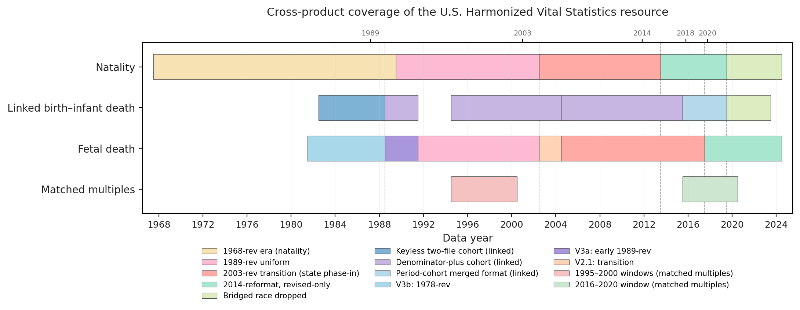

# Data Resource Profile: U.S. Harmonized Vital Statistics microdata, 1968–2024

<!-- FLAG (IJE-required, was missing): IJE Data Resource Profiles require a short Abstract. The draft below uses only claims already in the body; confirm IJE's current abstract word limit and trim if needed. -->

## Abstract

The U.S. Harmonized Vital Statistics (HVS) microdata resource integrates and disseminates harmonized U.S. natality (1968–2024; 201.2 million records), linked birth–infant death (1983–2023; 149.4 million records, with a permanent 1992–1994 linkage gap), fetal death (1982–2024; 2.4 million records), and matched-multiples (1995–2020; 1.7 million records) public-use microdata released by the National Center for Health Statistics (NCHS). NCHS distributes these events as annual fixed-width files whose layouts change at certificate-revision transitions (principally the staggered 1989-to-2003 transition), within-revision reformats, and state-by-state staggered adoption, so the same variable can occupy different byte positions, use different codes, or be absent across years. HVS maps each product's per-era source fields to one stable column schema per product, validated cell-by-cell against the per-year aggregates NCHS publishes and reproduced byte-exact under a documented analytic filter. The resource is openly deposited under CC BY 4.0 with deterministic, re-runnable pipelines, and is, to our knowledge, the first openly published, reproducible, validated harmonization for these U.S. vital-statistics products.

## Key Features

<!-- FLAG (IJE terminology + placement + length): renamed from "HVS in a nutshell" (the HMD-2015 wording) to "Key Features" — current IJE terminology, which replaces "Profile in a nutshell" — and moved to the front (after the Abstract) per the current IJE template. IJE caps Key Features at ~200 words of brief complete sentences; this list runs slightly over. Trim to ≤200 words. -->

- The HVS resource integrates and disseminates harmonized U.S. natality, linked birth–infant death, fetal death, and matched-multiples public-use microdata as four harmonized products in Apache Parquet, with one stable column schema per product.

- Coverage: 201.2 million birth records (1968–2024), 149.4 million linked birth–infant death records (1983–2023, with a permanent 1992–1994 linkage gap), 2.4 million fetal death records (1982–2024), and 1.7 million matched-multiples records (1995–2020).
- The resource is, to our knowledge, the first openly published, reproducible, validated harmonization of U.S. fetal-death microdata across the 1978-, 1989-, and 2003-revision Standard Report boundaries, and the first to package these four vital-statistics products as one reproducible artifact.
- Each product is validated byte-exact against NCHS-published aggregates under a documented analytic filter and deposited CC BY 4.0 (2026) with open GitHub pipelines and a three-level verification ladder.
- Future releases are intended to extend each product forward as NCHS publishes new years and to transcribe the remaining matched-multiples 2016–2020 Table 2 cells.

## Data resource basics

The U.S. National Vital Statistics System counts every birth, fetal death, and infant death registered nationally — roughly 3.5–4 million live births, 20,000–30,000 fetal deaths, and 20,000 infant deaths a year.[^nvsr_births] NCHS has compiled these events since 1933 and released them as annual fixed-width public-use microdata since 1968 (natality) and the early 1980s (fetal death). The microdata underlie most U.S. perinatal-mortality and stillbirth trend studies, individual-level state disparity analyses, and age-period-cohort decompositions.

These microdata are difficult to use across years because layouts change at certificate-revision transitions (principally 1989→2003, plus earlier 1968→1989 and 1978→1989 boundaries), within-revision NCHS reformats, and state-by-state staggered 2003 adoption. The same variable can occupy different byte positions, codes, or be absent by year and state.

Prior work often restricted to single-revision windows[^salihu2004],[^willinger2009] or aggregate published rates[^hogue2011]; Ananth and colleagues excluded Hispanic ethnicity for lack of a harmonized column across the 2003 boundary.[^ananth2022]

NCHS itself publishes harmonized cross-revision tabulations (the *Births: Final Data* and *Fetal and Perinatal Mortality* *NVSR* series), but those are aggregate tables produced inside the agency on a fixed tabulation grid; only the published cells survive, so investigators needing microdata-level cross-revision analyses have had to repeat the harmonization privately for each study — a gap recent U.S. stillbirth-surveillance reviews confirm persists.[^gregory2024],[^nichd2024] To our knowledge, no openly published, reproducible, validated harmonized longitudinal microdata product has previously been available for U.S. natality, linked birth–infant death, or fetal death; HVS provides one — in the spirit of IPUMS-International[^ipums] and the Human Mortality Database[^hmd] — performing the harmonization once, in the open, with deterministic re-runnable pipelines.

The U.S. Harmonized Vital Statistics (HVS) microdata resource fills this gap. First released in 2026 and maintained by a single author, it is versioned on Zenodo (a concept DOI resolves to the latest version; version-specific DOIs let analyses pin to an exact release), with open-source pipelines openly developed on GitHub that run end-to-end from the public NCHS files on a laptop.

## Data resource area and population coverage

The HVS resource covers the United States from 1968 forward: natality 201,161,456 records (1968–2024); linked birth–infant death 149,386,620 (1983–2023; permanent 1992–1994 gap); fetal death 2,427,233 (1982–2024); matched multiples 1,665,568 (1995–1997, 1995–2000, 2016–2020). Per-year raw parquets preserving every documented source field are also disseminated.

Fetal-death 2003–2004 transition years and 1982–1991 backward extension are harmonized in the current release (Hispanic origin unavailable 1982–1988). The 1989–1991 layout was verified by 98,500 raw-byte comparisons with zero mismatches.

The natality file spans six era segments (five transitions); the linked file five segments (four transitions, plus the permanent 1992–1994 gap); the fetal-death file five segments (four transitions); and matched multiples three discrete publication windows (Table 1, Figure 1). Within each segment the layout is uniform; at the transitions record length, certificate revision, or both can change.

**Table 1.** Source-data era boundaries by product.

| Product | Era | Years | Record length | Certificate / revision |
|---|---|---|---|---|
| Natality | 1968-revision era (sub-layouts 1968 / 1969–1971 / 1972–1988 / 1989) | 1968–1989 | varies† | 1968 |
| Natality | Unrevised-only | 1990–2002 | 350 bytes | 1989 |
| Natality | Dual-certificate transition (long format) | 2003 | 1350 bytes | Dual |
| Natality | Dual-certificate transition (long format) | 2004–2005 | 1500 bytes | Dual |
| Natality | Dual-certificate transition (short format) | 2006–2013 | 775 bytes | Dual; unrevised-only fields blanked from 2009 |
| Natality | Revised-only | 2014–2024 | 1345 bytes | 2003 |
| Linked birth–infant death | Cohort, keyless two-file (denominator/numerator) | 1983–1988 | varies† | 1968 |
| Linked birth–infant death | Cohort, denominator-plus | 1989–2004 | varies† | 1989 (dual at 2003–2004; permanent 1992–1994 linkage gap) |
| Linked birth–infant death | Cohort, denominator-plus | 2005–2013 | 900 bytes | Dual |
| Linked birth–infant death | Cohort, denominator-plus | 2014–2015 | 1384 bytes | 2003 |
| Linked birth–infant death | Period-cohort merged (CO_SEQNUM × CO_YOD) | 2016–2023 | varies | 2003 |
| Fetal death | 1978-revision uniform | 1982–1988 | 200 bytes | 1978 |
| Fetal death | 1989-revision uniform | 1989–2002 | 360 bytes | 1989 |
| Fetal death | Dual-certificate transition | 2003–2004 | 1351 / 1501 bytes | Dual |
| Fetal death | 2003-revision transition | 2005–2017 | varies | Mixed (2003-revision A or 1989-revision S per state-year) |
| Fetal death | Revised-only | 2018–2024 | varies (2652 bytes) | 2003 |
| Matched multiples | 1995–1997 publication window | 1995–1997 | 502 bytes | 1989 |
| Matched multiples | 1995–2000 publication window | 1995–2000 | 754 bytes | 1989 |
| Matched multiples | 2016–2020 publication window | 2016–2020 | 155–157 bytes (variable) | 2003 |

† Record length varies by year within the era; the per-year byte-position layouts are documented in each product's `record_layout_*.csv`. The pre-1990 natality and pre-2005 linked layouts are reconstructed from the corresponding NCHS Natality and Cohort Linked File User Guides.

**Figure 1.** Cross-product coverage of the U.S. Harmonized Vital Statistics resource by data year. Each horizontal bar shows one product's source-layout eras; the vertical guides mark the 1989, 2003, 2014, 2018, and 2020 boundaries. The linked file's permanent 1992–1994 NCHS-linkage gap and the matched-multiples inter-window gap (2001–2015) appear as breaks; the matched-multiples 1995–1997 window is a subset of the 1995–2000 window and is drawn as a single block.

Geographic coverage is the United States as a whole. State-level identifiers are present in the per-year raw parquets for natality 1968–2024, linked birth–infant death 1983–2023, and fetal death 1982–2004. State identifiers are suppressed by NCHS in the 2003-revision (V1-era) fetal-death public-use files (2005 onward) and in the matched-multiples 2016–2020 window, and are therefore absent from the harmonized files in those years.

## Measures

Each product ships one stable harmonized schema (natality 84 columns; linked 97 including 1983–2004 cohort fields; fetal death 89; matched multiples 24). Each `harmonized_schema.csv` lists dtype, allowed values, coverage, comparability class, and source field per era; the full per-era mapping ships as `variable_crosswalk_working.csv` (Supplementary Table S1).

Harmonized measures span maternal and paternal demographics, pregnancy and delivery fields, linked infant outcomes (including ICD-10 cause of death), fetal-death-specific fields (including the NVSR tabulation flag), and constructed indicators (low birth weight, preterm birth, neonatal vs post-neonatal death) computed deterministically from the harmonized columns.

Sentinel values (`gestational_age_combined=99`, `birthweight=9999`, etc.) are converted to NaN in the derivation step before threshold comparisons, so constructed indicators return missing for sentinel-coded records while the harmonized parent retains the raw sentinel.

### Comparability classification

Every harmonized column is tagged with one of four comparability classes in the schema CSV: **full** (stable across all covered years), **partial** (consistent within era, cross-era differences documented), **within_era** (cross-era aggregation unsafe), or **not_available** (field not collected). A few fetal-death columns are irreducibly `within_era` — `breech_unrevised`, `delivery_place_unrevised`, and `maternal_race_bridged_detail` carry concepts the 1989 and 2003 revisions code incompatibly — and are flagged with explicit warnings; users are referred to the per-year raw parquets when within-era detail is required.

## Methods

The HVS resource is produced for each of the four products by deterministic open-source pipelines committed to GitHub and re-runnable end-to-end from the public NCHS source files:

1. **Acquisition.** Annual fixed-width zips, User Guide PDFs, and *NVSR* reports are obtained from the NCHS FTP server, with per-file SHA-256 checksums in each deposit's `file_inventory.csv`.
2. **Parsing.** Each file is parsed using era-specific `record_layout_*.csv` byte-position-to-field-name mappings derived from the NCHS User Guides.
3. **Type casting and renaming.** Per-era raw fields are renamed to harmonized columns and cast to a common dtype — one harmonized parquet per source year.
4. **Value-level normalization.** A minority of variables are recoded across the revision boundary because the eras code the same concept differently — for fetal death, five normalizations (`fetal_sex`, `delivery_method_recode`, `maternal_race_bridged`, `paternal_age_recode11`, `delivery_place_recode`), with the original detail preserved in the raw parquets; the natality and linked products receive analogous normalizations across the 2014 reformat.
5. **Derivation.** Low birth weight, preterm birth, gestational-age recodes, neonatal vs post-neonatal death, and ICD-10 cause groupings are computed deterministically from the harmonized columns.
6. **Validation.** Per-year counts and rates are computed under the canonical filter and compared cell-by-cell to the NCHS-published aggregates; each product's validation script prints a pass/fail table against the targets in `external_validation_targets.csv`.

Re-deriving from a fresh NCHS download produces a byte-identical file (SHA-256 in `PROVENANCE.md`). Three verification levels are supported: checksum (~10 s), validation-script (~1 min), and full pipeline re-run (~1–2 h).

## Data resource use

The resource was first released in 2026, so rather than a record of external uptake it is characterised here by worked examples distributed with the resource, each reproducing a published NCHS figure end-to-end from the harmonized parquets. Each product is distributed as Apache Parquet, readable in Python, R, Stata, SAS, and most modern tools: natality, the linked file, and fetal death each ship a harmonized parquet and a harmonized-plus-derived parquet (the canonical analysis file), and matched multiples ships as a single parquet. Per-product `quickstart.py`/`quickstart.R`, DuckDB views (`views.sql`), and a Stata/SAS bridge lower the entry barrier, and the three case studies below ship as executable notebooks under `notebooks/`. A canonical analytic filter reproduces the population on which NCHS computes its published rates — for fetal death, `tabulation_flag == '2'` and `residence_status != '4'`; for natality, `residence_status != '4'` — and applying it is the difference between reproducing NCHS's published per-year rates exactly and producing systematically biased counts.

**Case study 1: joint-use fetal mortality rates.** Shared column names (`data_year`, `maternal_age`, `maternal_race_bridged`, `hispanic_origin`, `residence_status`) let natality supply stratified live-birth denominators for fetal-death numerators. Shipped tabulations and the `joint_use_demo` notebook reproduce *NVSR 73-09* Table 4 byte-exact; convenience denominators ship with the fetal-death product.

**Case study 2: matched-multiples mortality.** The `matched_multiples_demo` notebook reproduces **109/109** committed documentation-table targets[^mm_validation] and the complete-twin-set infant mortality rate (10.14 per 1,000), illustrating analyses within a single delivery set.

**Case study 3: cross-revision race-stratified trends.** Stable schemas across the 1978, 1989, and 2003 revisions support continuous race-stratified series; shipped `_x_maternal_race` tabulations and the `cross_race_fetal_mortality` notebook span 1982–2024 fetal mortality across four source eras (2018 bridged-race discontinuity explicit), including Hispanic origin where Ananth and colleagues excluded it for lack of a harmonized column[^ananth2022].

<!-- FLAG (verify before submission): cross_race_fetal_mortality.ipynb is currently UNEXECUTED (0/16 code cells run, no outputs); I could not run it here because the derived parquets are gitignored and absent locally. Execute it so case study 3 rests on a run notebook. The validation claim above is anchored to the shipped, NVSR-reconciled `_x_maternal_race` tabulations, which are independent of the notebook. Case studies 1 and 2 are fully executed with the cited values present in outputs (73-09/PASS; 10.14/Table 1/byte). Also: PROJECT_STRUCTURE.md still lists joint_use_demo as a "stub" — stale; it is fully executed. -->

These examples are illustrative rather than exhaustive. The resource is designed to enable cross-revision stillbirth disparity trends by maternal race, age, and Hispanic origin; secular low-birth-weight, preterm, and gestational-age trends back to 1968 (natality) and 1982 (fetal death); period and cohort decompositions of perinatal and infant mortality; cause-specific neonatal-mortality trends from 2014; and policy natural-experiment studies spanning the 2003 rollout. As an openly deposited resource released without access barriers, external applications are expected to accrue following publication.

## Strengths and weaknesses

Five strengths shape the resource. **Comparability** across certificate revisions through one stable schema per product, every column tagged with a comparability class and warnings where reconciliation is impossible. **Validation** against NCHS-published per-year aggregates under the canonical filter: natality **249/249** external targets[^zenodo_validation]; linked **33/35** byte-exact for 2005–2023 (two cells differ by one null-weight survivor record) plus 19/19 pre-2005 cohort checks; fetal death 29/29 counts and 26/26 fetal-mortality rates (13/19 *NVSR 73-09* detail cells exact); matched multiples **109/109** documentation-table targets[^mm_validation]. **Reproducibility** through deterministic pipelines, SHA-256 checksums, and per-year raw parquets. **Accessibility** through CC BY 4.0 without application or credentialing. **Joint-use design**: aligned column names and codings for matched numerator–denominator strata.

Weaknesses are of two kinds: NCHS public-use suppression passed through, and cross-revision incomparability documented rather than imputed. Fetal-death cause-of-death coding is absent before 2014 and sparse from 2018 onward (pre-2014 codes are RDC-only). State identifiers are suppressed in V1-era fetal-death files (2005 onward) and matched-multiples 2016–2020. Several V1-era fetal-death fields (`maternal_education`, `paternal_age_combined`, `maternal_education_unrevised`) are blank where NCHS dropped them. No 1989/2003 maternal-education bridge is provided. Backward extensions carry limits: pre-1990 natality rates use an LMP-reporting-area preterm denominator and 1968 targets that are indirect or PUF-definitional[^pre1990_1968]; linked 1983–1988 is keyless; 1983–1984 uses a 50%-area weighted sample; 1992–1994 is a permanent gap; 1983–1998 lacks an ICD-9→ICD-10 crosswalk. Matched multiples: only 2016–2020 Table 2 remains uncommitted. State reporting quirks during 1992–2002 fetal death are preserved.[^state_quirks]

## Future developments

<!-- FLAG (the main HMD-style over-claim): a single-author static deposit should not promise institution-style perpetual maintenance. Softened "the roadmap now commits the project to" → a design property plus author intent. -->

Earlier roadmaps listed the fetal-death 2003–2004 transition years and the 1982–1991 backward extension, pre-1990 natality rate benchmarking, and matched-multiples cell-level validation for the 1995–1997 and 1995–2000 windows as planned; all have now shipped (see above). The resource is designed to be forward-extensible without retroactive schema changes; planned additions, subject to the maintenance capacity of a single-author project, include:

- **Forward extension.** The harmonization is forward-extensible by adding entries to the era-specific record-layout CSVs as NCHS publishes new source files, with no retroactive schema changes; the author intends to extend each product as new years are released.
- **Matched-multiples 2016–2020 Table 2.** Gender × maternal-age cells for the 2016–2020 window remain to be transcribed (the published table is not in the public distribution); the 1995–1997 and 1995–2000 Table 1 and Table 2a cells are committed.
- **Cohort cause-of-death harmonization.** An ICD-9-to-ICD-10 crosswalk for the 1983–1998 linked-cohort causes of death is a deferred derivation.
- **Restricted-use products.** Census record linkage and NCHS Research Data Center geographic-identifier files are out of scope for the public-use resource; users who need these layers are referred to the corresponding NCHS programs.

## Data resource access

The HVS resource is deposited on Zenodo under CC BY 4.0 for the harmonization layer; the underlying NCHS source data are U.S. Government works not subject to copyright (17 U.S.C. § 105). No data-use agreement, application, or credentialing is required. It is deposited as a single multi-product record: the version-of-record DOI is 10.5281/zenodo.20326150 (v1.0.1) and the concept DOI resolves to the latest version, while version-specific DOIs let analyses pin to an exact release. The superseded single-product deposits remain immutable for provenance (natality and linked: 10.5281/zenodo.19363074; fetal death v2.0.0: 10.5281/zenodo.20031571). The deposit is self-describing — parquets, user documentation, schema/validation/layout CSVs, and quickstarts — and pipeline source code is openly developed on GitHub at https://github.com/yoelplutchok/vital-statistics-harmonization; every parquet re-derives bit-for-bit from the public NCHS source files via those pipelines. Cross-product worked examples — a joint-use fetal-mortality demonstration validated against *NVSR 73-09* Table 4, a matched-multiples demonstration, and a paper-companion notebook recomputing this manuscript's numeric claims from the parquets — ship under `notebooks/`.

## Related resources

The unified deposit supersedes two earlier single-product HVS deposits, immutable for provenance: harmonized natality and linked birth–infant death (concept DOI 10.5281/zenodo.19363074) and harmonized fetal death 1992–2022 (10.5281/zenodo.20031571).

The closest structural precedent is the Berkeley Unified Numident Mortality Database, which similarly harmonizes decades of multi-version U.S. government administrative microdata into a single, openly deposited, reproducible research file.[^bunmd] Among broader harmonized-microdata resources, IPUMS-International integrates international census microdata across countries and years[^ipums] and the Human Mortality Database harmonizes national mortality and life-table data across statistical protocols,[^hmd] while the NBER vital-statistics archive[^nber] and ICPSR[^icpsr] redistribute the NCHS public-use files year by year without harmonizing across the certificate-revision boundary. None covers harmonized U.S. natality, fetal-death, or linked birth–infant death microdata across revisions — the gap HVS fills.

## Ethics approval

Not required. The HVS resource is built exclusively from de-identified public-use microdata released by NCHS under U.S. federal law, with no identifying or restricted-use fields and no human-subjects contact.

## Author contributions

YP is the sole author. YP conceived and designed the resource, built and validated the harmonization pipelines, drafted and revised the manuscript, and is responsible for the final content. <!-- YP: confirm or revise -->

## Use of artificial intelligence (AI) tools

Anthropic's Claude (Opus-class models) was used as a coding-and-writing agent throughout the project: pipeline development, validation scripting, internal documentation, and manuscript drafting and revision. Every numeric claim in this manuscript is derived from the harmonized parquets and the committed per-product validation tables (`validation_results.csv` / `external_validation_*` and each product's `PROVENANCE.md`); a companion notebook (`notebooks/paper_companion.ipynb`) recomputes the cross-product claims directly from the shipped parquets. The author reviewed all AI-suggested content and retains responsibility for the final manuscript. <!-- YP: confirm wording in line with IJE policy and edit tool/model versions as needed. Note for submission: re-run notebooks/paper_companion.ipynb against the current v3.0.0 / v4.0.0 / v2.4.0 + matched-multiples parquets to refresh the per-claim synthesis before submitting. -->

## Conflict of interest

None declared.

## Funding

None declared. <!-- YP: edit if any funding source applies -->

## References

[^nvsr_births]: Osterman MJK, Hamilton BE, Martin JA, Driscoll AK, Valenzuela CP. Births: Final Data for 2023. *Natl Vital Stat Rep* 2024;73(11). Gregory ECW, Valenzuela CP. Fetal Mortality: United States, 2022. *Natl Vital Stat Rep* 2024;73(09).

[^salihu2004]: Salihu HM, Aliyu MH, Pierre-Louis BJ, Alexander GR. Racial disparity in stillbirth among singleton, twin, and triplet gestations in the United States. *Obstet Gynecol* 2004;104(4):734–740.

[^willinger2009]: Willinger M, Ko CW, Reddy UM. Racial disparities in stillbirth risk across gestation in the United States. *Am J Obstet Gynecol* 2009;201(5):469.e1–8.

[^hogue2011]: Hogue CJR, Silver RM. Racial and ethnic disparities in United States: stillbirth rates, trends, risk factors, and research needs. *Semin Perinatol* 2011;35(4):221–233.

[^ananth2022]: Ananth CV, Fields JC, Brandt JS, Graham HL, Keyes KM, Zeitlin J. Evolving stillbirth rates among Black and White women in the United States, 1980–2020: a population-based study. *Lancet Reg Health Am* 2022;16:100380.

[^state_quirks]: Oklahoma did not report Hispanic origin during 1992–2002; Maryland (1992–1998) and Massachusetts (1992–1997) did not report Hispanic origin in early years; Louisiana under-reported plurality 1992–1994. These quirks reproduce the corresponding *NVSR 57-08* footnotes; users analysing Hispanic-origin fetal mortality in the V2 era should restrict to states with complete reporting.

[^zenodo_validation]: Natality targets comprise 56 resident-birth counts (1968–2024), 44 pre-1990 low-birth-weight and preterm rate cells (1968–1989), and 149 *Births: Final Data* rate/indicator cells (1990–2024). Zenodo deposit v1.0.1 validation tables predate RD.1/RD.1b; publish a docs-only v1.0.2 (parquets unchanged) before submission so the cited DOI matches the manuscript.

[^mm_validation]: 41 Table 1-equivalent cells across three publication windows plus 68 Table 2a twin-set cells (gender × maternal age × outcome) for 1995–1997 and 1995–2000.

[^pre1990_1968]: Pre-1990 preterm rates use NCHS's LMP-reporting-area, known-gestation denominator (see `natality/docs/COMPARABILITY.md`). The 1968 low-birth-weight target (8.2%) is an indirect cite (no direct 1968 MVSR headline; bracketed by adjacent years). The 1968 preterm target (8.9%) is computed from the public-use GESTREC recode, not transcribed from a published headline.

[^ipums]: Sobek M, Cleveland L, Flood S, et al. Data Resource Profile: IPUMS-International. *Int J Epidemiol* 2017;46(2):390. https://doi.org/10.1093/ije/dyx012

[^hmd]: Barbieri M, Wilmoth JR, Shkolnikov VM, et al. Data Resource Profile: The Human Mortality Database. *Int J Epidemiol* 2015;44(5):1549–1556. https://doi.org/10.1093/ije/dyv105

[^bunmd]: Breen CF, Goldstein JR. Berkeley Unified Numident Mortality Database: public administrative records for individual-level mortality research. *Demogr Res* 2022;47(5):111–142. https://doi.org/10.4054/DemRes.2022.47.5

[^gregory2024]: Gregory ECW, Barfield WD. U.S. stillbirth surveillance: the national fetal death file and other data sources. *Semin Perinatol* 2024;48(1):151873.

[^nichd2024]: National Institute of Child Health and Human Development. Stillbirth Working Group of Council Report. Bethesda, MD: NICHD; July 2024.

[^nber]: National Bureau of Economic Research. Vital Statistics Natality and Mortality Data. Cambridge, MA: NBER. https://www.nber.org/research/data/vital-statistics-natality-birth-data

[^icpsr]: Inter-university Consortium for Political and Social Research. Natality Detail File and Cohort Linked Birth–Infant Death files (NCHS). Ann Arbor, MI: ICPSR.
